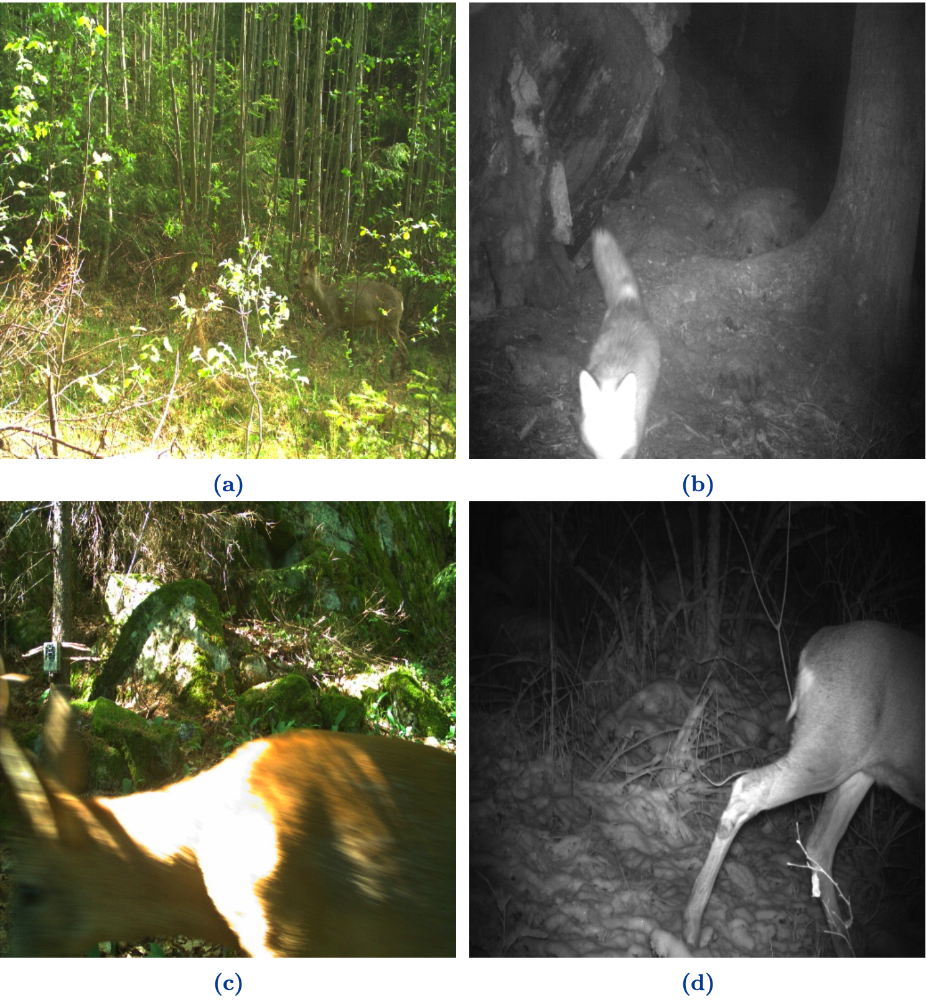

# Metadata Augmented Deep Neural Networks for Wild Animal Classification

This repository contains code for classifying camera trap images using various deep learning models and metadata fusion techniques. 

## Table of Contents
1. [Installation](#installation)
2. [Usage and Dataset](#usage-and-dataset)
3. [File Descriptions](#file-descriptions)
4. [Model Weights](#model_weights)
5. [License](#license)
6. [Contributing](#contributing)

## Installation

1. Clone the repository:
    ```
    git clone https://github.com/ammarlodhi255/camera-trap-classification.git
    ```
    ```
    cd camera-trap-classification
    ```

2. Create and activate a virtual environment:
   ```
   python -m venv venv
   source venv/bin/activate  # On Windows use `venv\Scripts\activate`
   ```

3. Install the required packages:
   ```
   pip install -r requirements.txt
   ```

   Note: If you're using GPU acceleration, ensure you have the appropriate CUDA toolkit installed.

## Usage and Dataset

1. Preparing the dataset:
   - The dataset is collected from NINA Viltkamera dataset. It contains 170,000 sample images along with metadata from the [NINA website](https://viltkamera.nina.no/). The webscrapping code is located inside of the file [webscrapper.js](./webscrapper.js). Following is the NINA web interface.

   


   - The dataset is highly imbalanced and many classes contained no images. Our curated dataset can be accessed from two links. The first link contains [images_part_1.zip](https://figshare.com/articles/dataset/images_part_1/26832043?file=48792940) file and the second contains rest of images in a file named [images_part_2.zip](https://figshare.com/articles/dataset/images_part_2/26832475?file=48793543).
   - Ensure your camera trap images are organized in the expected directory structure. Download the important json files from [JSON Files](https://figshare.com/articles/dataset/JSON_files/26832049?file=48793426). Each entry in the json "annotations" is a single image file. To get the associated image, append the "filename" of the json entry with the path to the image files. So say your images are stored at C:\NINA\images, and you have a filename "96624a46-4bc6-46c9-9770-370bf6d84718.jpg", then the correct image would be C:\NINA\images\96624a46-4bc6-46c9-9770-370bf6d84718.jpg.
   - Update the `bp` variable in the scripts to point to your dataset location.
   - Image variety and challenges are shown in the following pictures.

   

2. Run the main classification script:
   ```
   python viltkamera_classifier.py
   ```

3. For metadata-only experiments:
   ```
   python metadata_classifier.py
   ```

4. To evaluate metadata models:
   ```
   python evaluate_metadata_models.py
   ```

Modify the scripts as needed to adjust model configurations, data preprocessing steps, or evaluation metrics.

## Model Weights
All the model weights can be downloaded from the URL [model-weights](https://figshare.com/s/c4ca09789621053d5cb7). You can load the weights and directly perform classification and inference on animal species.


## Source Files Descriptions

- `viltkamera_classifier.py`: Main script for training and evaluating image classifiers.
- `metadata_classifier.py`: Implements a metadata-only classifier for experiments.
- `fusion_model_v2.py`: Defines fusion models combining image and metadata features.
- `conventional_models.py`: Implements various deep learning architectures.
- `evaluate_metadata_models.py`: Analyzes results from metadata-only experiments.
- Additional code related to UMAP, extraction of scene attributes, and other processes described in the paper can be found in [src](./src) and [notebooks](./notebooks) folders.

## License

This project is licensed under the MIT License - see the [LICENSE](LICENSE) file for details.

## Contributing

Contributions are welcome! Please feel free to submit a Pull Request.

1. Fork the repository
2. Create your feature branch (`git checkout -b feature/AmazingFeature`)
3. Commit your changes (`git commit -m 'Add some AmazingFeature'`)
4. Push to the branch (`git push origin feature/AmazingFeature`)
5. Open a Pull Request
